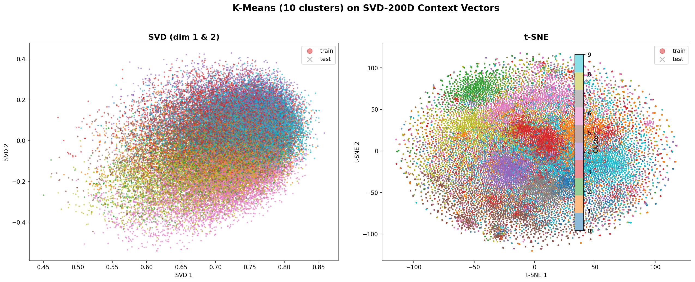
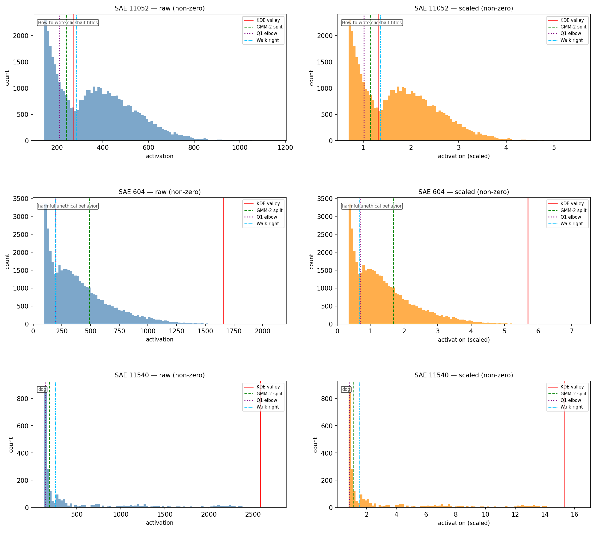
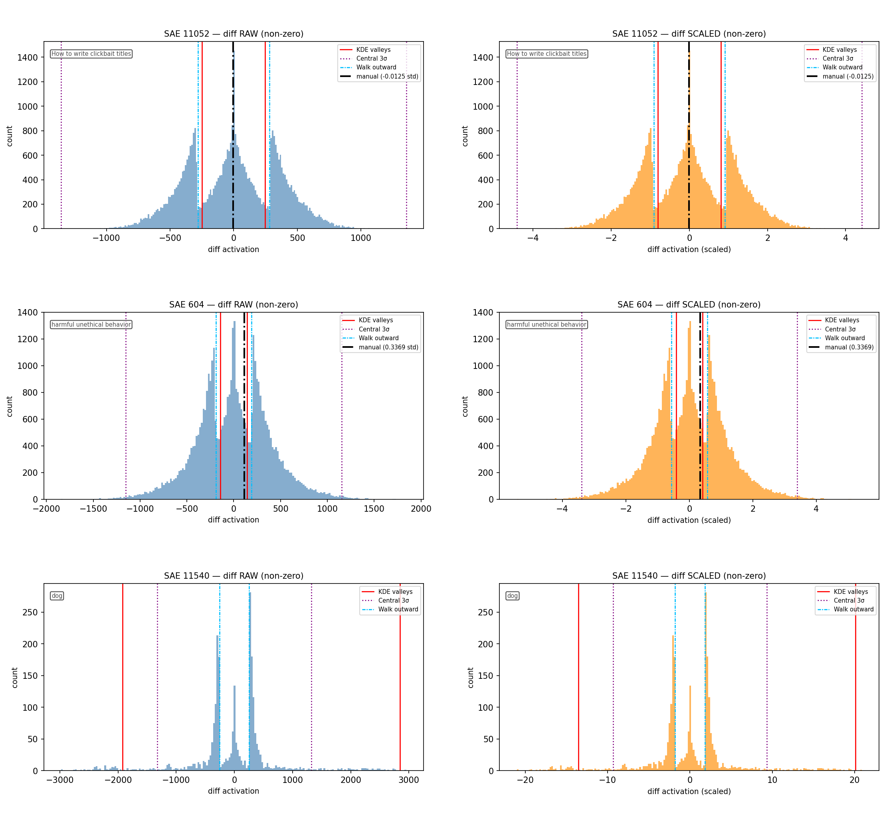

# Explaining Headline A/B Test Outcomes with Sparse Autoencoder Features

What makes one news headline get more clicks than another? Can we decompose that question into interpretable pieces using the internal representations of a language model?

This repository documents a sequence of experiments exploring those questions, using the **Upworthy Research Archive** (real A/B-tested headlines with click-through rate data) and **Sparse Autoencoder (SAE) features** extracted from Google's Gemma-3-4B model. Prediction accuracy serves as a sanity check — if the features can't predict anything, they probably aren't capturing anything real — but the primary goal is to surface readable, interpretable patterns that describe *what kinds of linguistic choices* make a headline more clickable.

The short answer: SAE features carry a real but modest predictive signal (~62% accuracy, 0.76 AUC), and the features that matter most are interpretable — clickbait-style framing, emotional intensity, curiosity gaps, and use of demonstrative pronouns like "this."

---

## Table of Contents

- [Motivation](#motivation)
  - [The Representation Problem](#the-representation-problem)
  - [Sparse Autoencoders: Making LLM Representations Readable](#sparse-autoencoders-making-llm-representations-readable)
  - [Our Approach](#our-approach)
- [Dataset](#dataset)
- [Experiment 1: Data Exploration and Preprocessing](#experiment-1-data-exploration-and-preprocessing)
- [Experiment 2: SAE Feature Extraction — First Attempt](#experiment-2-sae-feature-extraction--first-attempt)
- [Experiment 3: First Models — Bad Performance](#experiment-3-first-models--bad-performance)
- [Experiment 4: Redesigned Extraction — Context + Diff Decomposition](#experiment-4-redesigned-extraction--context--diff-decomposition)
- [Experiment 5: XGBoost on Context+Diff — First Real Signal](#experiment-5-xgboost-on-contextdiff--first-real-signal)
- [The Subset Hypothesis](#the-subset-hypothesis)
- [Experiment 6: Clustering Headlines — Looking for Subgroups](#experiment-6-clustering-headlines--looking-for-subgroups)
- [Experiment 7: Model-Based Recursive Partitioning (MOB) — Overfit](#experiment-7-model-based-recursive-partitioning-mob--overfit)
- [Experiment 8: Feature Binarization + RuleFit — Best Results](#experiment-8-feature-binarization--rulefit--best-results)
- [Results Summary](#results-summary)
- [Key Takeaways](#key-takeaways)
- [Limitations](#limitations)
- [Repository Structure](#repository-structure)
- [Setup](#setup)

---

## Motivation

People have been A/B testing headlines for years, but the results are usually just a winner and a loser — you know *which* headline won, but not *why*. To go further, we need some way to represent text as numbers that a statistical model can work with.

### The Representation Problem

Early approaches used simple statistics: word counts, TF-IDF, n-grams. These are interpretable — you can point at a coefficient and say "the word 'shocking' is associated with more clicks" — but they miss context, word order, and meaning.

Then came dense embeddings: Word2Vec and GloVe gave each word a rich vector that captured semantic relationships, but these are static — the word "bank" gets the same vector whether it means a riverbank or a financial institution. More importantly, these are word-level representations, not sentence-level ones.

Contextual embeddings from models like BERT and GPT changed this. They produce a representation for an entire sentence (or each token in context), capturing meaning, syntax, and nuance all at once. These representations are powerful — they drive state-of-the-art performance on almost everything — but they're also completely opaque. A 2,048-dimensional dense vector from a transformer doesn't have a "this dimension means emotional language" interpretation. You get better predictions but lose understanding. The classic black-box tradeoff.

### Sparse Autoencoders: Making LLM Representations Readable

Mechanistic interpretability research has been working on this problem. One approach: train **Sparse Autoencoders (SAEs)** on LLM activations. The idea is to take those dense, unreadable activation vectors and re-represent them in a different basis — one that's sparse (most entries are zero) and where each dimension corresponds to a recognizable concept.

An SAE trained on a language model's internal activations learns to decompose them into thousands of features — things like "mentions of holidays," "shocking scenarios," or "use of the word 'this'." Each feature fires sparsely (only on relevant inputs) and can be labeled with a human-readable description. These labels come from an **automated interpretability** process: an LLM examines the text examples that activate each feature most strongly, looks at the associated logits, and generates a short description of what pattern the feature seems to detect. The results are hosted on [Neuronpedia](https://www.neuronpedia.org/) and can be downloaded programmatically.

This gives us a vocabulary for talking about text in terms of interpretable semantic dimensions rather than raw tokens or opaque vectors.

### Our Approach

The idea in this project: encode A/B-tested headlines through an LLM, decompose the activations with an SAE, and then figure out which of those features are associated with getting more clicks. We're essentially using SAE features as our data representation — the same way an earlier project might have used TF-IDF or BERT embeddings — but with the advantage that each feature comes with a name. The predictive models are a means to an end — they help us identify which features matter and how they interact, so we can describe clickability in human-readable terms rather than just picking winners.

## Dataset

The **Upworthy Research Archive** contains A/B test data from the news website Upworthy. Each "test" compared 2–5 headline variants for the same article, with real impression and click counts.

- **Source**: [Upworthy Research Archive (OSF)](https://osf.io/jd64p/)
- **Splits**: exploratory, confirmatory, holdout (we primarily use confirmatory)
- **Scale**: ~13,500 unique test IDs, ~57,000 headline pairs after sampling
- **Target**: which headline in a pair got a higher click-through rate (CTR)

The preprocessing pipeline (`data_preprocess.py`) cleans HTML tags, deduplicates, removes single-headline tests, and computes CTR per headline.

---

## Experiment 1: Data Exploration and Preprocessing

**Scripts**: `data_analysis.py`, `data_preprocess.py`

The first step was understanding the dataset. `data_analysis.py` checks:
- Line counts across the three CSV splits (exploratory, confirmatory, holdout)
- Whether the `first_place` label matches highest CTR (it usually does, but not always)
- Whether `(headline, lede)` pairs are unique within each test

`data_preprocess.py` then:
1. Extracts the relevant columns: `test_id`, `headline`, `lede`, `impressions`, `clicks`
2. Removes duplicates and tests with only one headline
3. Cleans HTML tags and entities
4. Computes CTR and marks the best headline per test

This gave us clean CSVs in `data/cleaned_archive/` ready for feature extraction.

---

## Experiment 2: SAE Feature Extraction — First Attempt

**Script**: `extract_sae_vectors.py`

### The Pipeline

For each headline, we:
1. Wrap it in a Gemma-3 chat prompt (`<start_of_turn>user\n{headline}<end_of_turn>\n<start_of_turn>model\n`)
2. Run it through **Gemma-3-4B-IT** and extract residual stream activations at **layer 22**
3. **Mask out instruction tokens** — only keep activations for the actual headline content tokens (not the prompt template)
4. Encode the content activations through a **JumpReLU SAE** (GemmaScope-2, 16k width, medium L0) to get a 16,384-dimensional sparse vector
5. **Max-pool** across all content token positions to get a single vector per headline

The LLM we used is **Gemma-3-4B-IT** (Google's 4-billion parameter instruction-tuned model). The SAE comes from the **GemmaScope-2** project, which provides pre-trained sparse autoencoders for various layers and widths of the Gemma model family:

- **SAE**: `google/gemma-scope-2-4b-it`, layer 22 (of {9, 17, 22, 29}), 16k width (of {16k, 65k, 262k}), medium L0 sparsity
- This gives us **16,384 SAE features**, each with a label generated through Neuronpedia's automated interpretability pipeline (an LLM analyzes the top-activating examples for each feature and writes a short description of the pattern)

### First Approach: Best-vs-Worst Delta Vectors

For each test ID, we took only the best (highest CTR) and worst (lowest CTR) headlines and computed:
- `delta = SAE(best) - SAE(worst)` → label = 1
- `delta = SAE(worst) - SAE(best)` → label = 0

This gave us one pair per test, with symmetric delta vectors. The vectors were stored as sparse matrices (`.npz` files) since most SAE features are zero for any given headline.

**Memory optimization**: The LLM takes ~6.3 GB VRAM. We kept the SAE on CPU, processed in batches of 5, and saved to disk in minibatches of 5,000 examples to avoid OOM.

---

## Experiment 3: First Models — Bad Performance

**Scripts**: `logistic_regression.py`, `xgboost_std.py`, `decision_tree_std.py`

### What We Tried

- **SGD Logistic Regression** (L2, alpha=0.0001) on the 16,384-dim delta vectors
- **XGBoost** (40 estimators, max depth 6) on the same vectors

### What Happened

Both models achieved roughly **50–55% accuracy** — barely above random coin flip for a balanced binary task. This was discouraging.

### What Went Wrong

Two problems were identified:

1. **Data leakage in train-test split**: We initially split by *pairs*, but pairs from the same `test_id` could land in both train and test. Since the reverse pair (worst-best) is literally the negation of (best-worst), the model could memorize patterns.

2. **Too few pairs**: Using only best-vs-worst gave us just ~4,300 pairs from the confirmatory set. With 16,384 features, this is a very wide matrix with very few rows.

3. **Best-vs-worst only captures extremes**: Many tests had 3–5 headlines with gradual CTR differences. Throwing away the middle headlines wasted information.

---

## Experiment 4: Redesigned Extraction — Context + Diff Decomposition

**Scripts**: `extract_sae_vectors_meandiffweight.py`, `enrich_meta.py`

This was the major redesign that made everything else possible.

### Why Not Just Predict CTR from a Single Headline?

A natural first idea is: take each headline's SAE vector and predict its CTR directly. But this mostly teaches the model which *topics* are popular — crime stories, celebrity gossip, video content — rather than what makes one headline beat another for the same article. It captures base rates of clickability, not the causal effect of headline wording.

Since we have A/B test data (multiple headlines for the same article), we can do better: compare headlines *within* each test, and learn what makes one outperform another. That requires pairwise comparisons and modeling the *difference* in CTR.

### New Pair Sampling

Instead of only best-vs-worst, we now sample **all C(N,2) pairs** within each test ID (capped at 10 random pairs per test for memory). For each pair, the order is randomized. This gave us ~57,000 pairs from ~13,500 test IDs — a >10x increase in data.

### Context + Diff Decomposition

For a pair of headlines A and B with SAE vectors `v_A` and `v_B`, we compute:

- **Context vector** = `(v_A + v_B) / 2` — captures what the *topic/content* is about (shared between both headlines)
- **Diff vector** = `v_A - v_B` — captures what's *different* between the two headlines

These are concatenated into a single `[context | diff]` vector of dimension 32,768 (16,384 context + 16,384 diff features).

**Why include context at all?** Modeling only the diff vector learns one global set of rules — "violence helps," "curiosity gaps help" — applied uniformly everywhere. But clickability rules might be context-dependent: what works for political headlines might not work for cute animal stories. Including context lets a model potentially learn different rules for different kinds of content.

### Weight Schemes

Not all pairs are equally informative. A pair where one headline got 5% CTR and the other got 5.01% is near-noise; a pair with 3% vs 8% is a strong signal. We compute three sample weights:

1. **CTR diff** (`w_diff`): `|CTR_A - CTR_B|` — simplest
2. **Logit diff** (`w_logit`): `|logit(CTR_A) - logit(CTR_B)|` — better for extreme CTRs
3. **Beta posterior** (`w_beta`): Jeffreys Beta(0.5, 0.5) posterior mean logit diff, scaled by `sqrt(min(impressions))` — accounts for statistical confidence

### Proper Group Split

We switched to `GroupShuffleSplit` by `test_id` so that all pairs from the same test always end up in the same split. No more data leakage.

### Enriched Metadata

`enrich_meta.py` added a regression target (`logit_diff = logit(CTR_A) - logit(CTR_B)`) and confidence weight (`sqrt(min_impressions)`), enabling both classification and regression framings.

---

## Experiment 5: XGBoost on Context+Diff — First Real Signal

**Scripts**: `logistic_regression_meandiffweight.py`, `download_explanations.py`, `decision_tree_std.py`

### Results

XGBoost (40 estimators, max depth 6, weighted by CTR diff) on the full 32,768-feature context+diff vectors:

| Metric | Value |
|---|---|
| Accuracy | 61.0% |
| Weighted Accuracy | 67.2% |
| F1 | 0.610 |
| AUC-ROC | 0.739 |

**This was the first real above-chance signal.** The context+diff decomposition and proper pair sampling made the difference.

However, XGBoost on the full feature set still learns one global model. A linear model (or even a boosted ensemble) on diff features learns a single set of coefficients shared across all examples. It can't implement "if the article is about politics, use rule set A; if it's about animals, use rule set B." All pairs share the same decision surface. This means that if a feature has *opposite* effects in different contexts, those effects average out and the model sees noise. We'll revisit this limitation in the next experiments.

### Interpretability via Neuronpedia

To understand what the model learned, we:
1. Downloaded all 16,384 feature explanations from Neuronpedia (`download_explanations.py`) — each SAE feature has a human-written description of what it detects
2. Mapped XGBoost's feature importances back to SAE feature descriptions
3. Trained an interpretable decision tree on the XGBoost-selected features

### Top Features (from XGBoost importance)

Most important features were **diff features** (not context), suggesting the model primarily learns *what's different* between headlines rather than *what the topic is*:

- `diff_1389`: "past events"
- `diff_6843`: "introduced person or concept"
- `diff_11052`: "How to write clickbait titles" (!)
- `diff_1531`: "discovery and revelation"
- `diff_1115`: "describing people or animals"
- `diff_5439`: "offensive content"
- `diff_4053`: "joke, humor, comedy"
- `diff_1213`: "intense negative emotions"

The fact that a feature literally called "How to write clickbait titles" is among the top predictors is both validating and amusing.

We also trained an interpretable decision tree on the XGBoost-selected features to visualize the decision boundaries:


---

## The Subset Hypothesis

The global model from Experiment 5 treats all headline pairs the same. But a more realistic assumption is that clickability rules are **context-dependent** — different kinds of articles might follow different rules.

Consider a concrete example: the SAE feature "cute" might appear globally unimportant. But in pet-related headlines, "cute" could increase CTR, while in political headlines, "cute" could decrease CTR. A global model averages these opposing effects and reports "no effect" — even though strong conditional effects exist in both directions.

If this kind of structure is real, we need models that can do **mode switching**: learn different coefficient sets for different subpopulations. The next three experiments tried different ways to achieve this.

---

## Experiment 6: Clustering Headlines — Looking for Subgroups

**Scripts**: `clustering_context.py`, `xgboost_cluster_comparison.py`

### The Idea

The simplest way to find subgroups: cluster headlines by their context vectors (what the article is about), then train separate models per cluster. Political headlines might benefit from urgency, while lifestyle headlines might benefit from curiosity gaps.

### What We Tried

1. **Dimensionality reduction**: TruncatedSVD to 200 dimensions on the 16,384-dim context vectors (explained variance ~reasonable)
2. **HDBSCAN** (first attempt) — complete failure. Depending on parameters, it found either 0 clusters (everything is noise) or 180+ tiny clusters. The SAE context space is apparently too uniform for density-based clustering.
3. **K-Means** (10 clusters) — produced balanced clusters of 2,500–7,000 examples each
4. **UMAP** — tried and abandoned (didn't improve clustering)
5. **t-SNE** — used for visualization only

We then trained **per-cluster XGBoost models** on the diff features within each cluster, and compared to the global model.



### Results

| Model | Accuracy | W. Accuracy | F1 | AUC |
|---|---|---|---|---|
| Global XGBoost | 61.0% | 67.2% | 0.610 | 0.739 |
| Combined per-cluster | 57.1% | 61.9% | 0.564 | 0.673 |
| **Delta** | **-3.9%** | **-5.3%** | **-0.046** | **-0.066** |

### Why It Failed

Per-cluster models performed **4% worse** across the board. Two things went wrong:

1. **Not enough data per cluster.** Splitting into 10 clusters gave each cluster only ~3,000–5,000 training examples with 16,384 features — far too few for XGBoost to learn meaningful patterns.

2. **Clusters aren't aligned with click behavior.** The clusters optimize for geometric similarity in SAE space, not for predictive heterogeneity. Headlines can be semantically similar but follow very different clickability rules, or semantically different but follow the same rules. It's like grouping days by sky color (blue/red/grey) when trying to predict storms — the grouping is real, but not aligned with what you're trying to predict.

---

## Experiment 7: Model-Based Recursive Partitioning (MOB) — Overfit

**Scripts**: `mob_tree.py`, `mob_tree_new.py`, `enrich_meta.py`

### The Idea

Clustering failed because it segmented the data without considering CTR. Decision trees *can* do mode switching — they can split on context and learn different rules in different branches — but standard trees (like XGBoost) tend to split on whatever reduces error fastest. If diff features are strongly predictive, they dominate the early splits and context features never get a chance.

MOB takes a different approach. Instead of pre-clustering, it uses a principled statistical test: **Model-Based recursive Partitioning (MOB)**. This technique:
1. Fits an inner model (Lasso regression on diff features → logit-diff target)
2. Tests whether the model's parameters are *stable* across different context feature values using the **supLM (supremum Lagrange Multiplier) test**
3. If instability is detected, splits the data on the context feature that causes the most instability
4. Recursively builds a tree where each leaf has its own regression model

This is the "proper" way to detect heterogeneous treatment effects — it doesn't just look for different residual means (like CART), but for *different model parameters*.

### Implementation

We built a custom `MOBTree` class from scratch with:
- Efficient vectorized screening of 16,384 context features per split (multi-dimensional R² screening, then supLM on top-200 candidates)
- supLM critical values from Hansen/Andrews tables
- Sparse matrix support throughout

### Results

The MOB tree built 19 nodes with 10 leaves. The splits were interpretable and interesting:

- Root split: `ctx_f5200: "recognizing or noticing"` ≤ 1.45
- Then: `ctx_f325: "here followed by is/are"`, `ctx_f6188: "urge, encourage, warn"`, `ctx_f3759: "evil AI, monsters"`, `ctx_f1931: "holidays and days"`, etc.

Each leaf had different top Lasso coefficients — for example, the "holidays and days" leaf had different clickbait predictors than the general population.

**But the test performance was terrible:**

| Model | Train R² | Test R² |
|---|---|---|
| Global Lasso | 0.164 | 0.107 |
| MOB Tree | 0.391 | **0.036** |

The MOB tree achieved high train R² by overfitting each leaf. Small leaves (393–547 samples) had 293–1,062 non-zero Lasso coefficients — a classic p >> n overfitting scenario. Some leaves even had *negative* test R² (predictions worse than predicting the mean).

### Lesson

MOB is designed for tabular data with moderate dimensionality. With 16,384 diff features per leaf, the per-leaf Lasso models had too many degrees of freedom relative to the leaf sizes. The supLM test correctly detected parameter instability, but the resulting subgroup-specific models couldn't generalize.

---

## Experiment 8: Feature Binarization + RuleFit — Best Results

**Scripts**: `feature_analysis.py`, `xgboost_bin.py`, `rulefit_bin.py`

### The Key Insight: SAE Feature Distributions

`feature_analysis.py` revealed that SAE feature activations have a characteristic two-part distribution:

- **Context features** (non-zero values): an exponential "barely-on" tail near zero (noise/leakage from the JumpReLU threshold), then a Gaussian body for genuinely activated features
- **Diff features** (non-zero values): a central Gaussian around zero (pairs where the feature activated similarly for both headlines), plus positive and negative exponential tails (pairs where one headline activated the feature much more)

This means the raw continuous activation values contain a lot of noise near zero. The actual signal is: "is this feature meaningfully active or not?"

| Context features (exponential noise tail + Gaussian body) | Diff features (central Gaussian + exponential tails) |
|---|---|
|  |  |

### The "Walk" Threshold Method

We developed a simple threshold method to separate noise from signal:

- **Context (walk-right)**: starting from the smallest non-zero value, walk rightward through a histogram. When the next 4 consecutive bins are all higher than the current bin, you've found the transition from the exponential noise tail to the Gaussian body. Threshold there → binary 0/1.
- **Diff (walk-outward)**: same idea but walking outward from zero in both directions → trinary -1/0/+1 (second headline activated more / no difference / first headline activated more).

This found valid thresholds for 11,823 of 16,384 context features and 11,815 of 16,384 diff features.

### XGBoost on Binarized Features

`xgboost_bin.py` applies these thresholds to the full 32,768-feature matrix, converting raw floats to int8 values (-1, 0, 1), then trains XGBoost:

| Metric | Value |
|---|---|
| Accuracy | **61.8%** |
| Weighted Accuracy | **68.5%** |
| F1 | **0.620** |
| AUC-ROC | **0.759** |

This slightly improved on the raw-feature XGBoost (61.0% → 61.8% accuracy, 0.739 → 0.759 AUC). More importantly, only **467 out of 32,768 features** had non-zero importance — the binarization helped XGBoost focus on genuinely informative features.

### RuleFit for Interpretable Rules

`rulefit_bin.py` takes the 467 XGBoost-selected binarized features and trains a **RuleFit** model (from the `imodels` library). RuleFit generates human-readable rules by combining tree-based conjunctions with linear terms:

| Metric | Value |
|---|---|
| Accuracy | 58.8% |
| Weighted Accuracy | 64.4% |
| F1 | 0.436 |
| AUC-ROC | **0.761** |

Slightly lower accuracy than XGBoost but comparable AUC, and the output is interpretable. The model found 52 conjunction rules and 443 linear terms.

### Top Predictive Features (from RuleFit)

The most important terms, all diff features, tell a coherent story about what makes a headline get more clicks:

| Rank | Feature | Direction | Interpretation |
|---|---|---|---|
| 1 | diff `'this'` | + | Using demonstrative "this" increases clicks |
| 2 | diff `How to write clickbait titles` | + | Clickbait-style language works |
| 3 | diff `remarkable and amazing qualities` | + | Superlative/amazing language helps |
| 4 | diff `discovery and revelation` | + | Curiosity-gap framing helps |
| 5 | diff `subtitles` | - | Subtitle-style text hurts (too dry?) |
| 6 | diff `past actions or events` | + | Past tense/narrative framing helps |
| 7 | diff `shocking or horrifying scenarios` | + | Emotional shock value increases clicks |
| 8 | diff `harmful unethical behavior` | + | Moral outrage framing helps |
| 9 | diff `math and trick questions` | + | Curiosity/puzzle framing helps |
| 10 | diff `stereotypes about gender roles` | + | Provocative social content gets clicks |

Context features (topic-level) appeared much less frequently in the top importances, confirming that *what's different between headlines* matters more than *what the article is about*.

---

## Results Summary

All methods below use the **canonical train/test split** (Train = 45,657, Test = 11,632) from `cluster_assignments.npz`, with sample weights = |CTR_A − CTR_B|. F1 is **macro-averaged** unless noted.

### Final Comparison Table

| # | Method | Features | Key Settings | Acc | F1 | AUC |
|---|--------|----------|-------------|-----|------|------|
| 1 | Logistic Regression | continuous 32k, StandardScaler | SGD L2 α=1e-4 | 0.606 | 0.606 | 0.750 |
| 2 | Decision Tree | continuous 32k, StandardScaler | depth=8, leaf≥20 | 0.556 | 0.551 | 0.630 |
| 3 | XGBoost | continuous 32k, StandardScaler | 100×d6, lr=0.1 | 0.616 | 0.616 | 0.759 |
| 4 | XGBoost clusters (agg) | continuous diff 16k, StandardScaler | 10 clusters, 40×d6 each | 0.571 | 0.564† | 0.673 |
| 5 | **XGBoost bin d=6** | **binarised 32k** | **100×d6, lr=0.1, csbt=0.7** | **0.618** | **0.619†** | **0.759** |
| 6 | XGBoost bin stumps d=1 | binarised 32k | 1200×d1, lr=0.05, sub=0.8 | 0.577 | 0.578† | 0.681 |
| 7 | Decision Tree bin | binarised 32k | depth=8, leaf≥20 | 0.553 | 0.549 | 0.625 |
| 8 | RuleFit (XGB-selected) | binarised 467 | n_est=25, tree_sz=4, max_rules=500 | 0.588 | 0.556 | 0.761 |

† Binary F1 reported (≈ macro for balanced classes; 5,791 vs 5,841).

### Earlier experiments (not directly comparable — different splits or feature sets)

| Experiment | Accuracy | AUC | Notes |
|---|---|---|---|
| Logistic Regression (v1, delta only) | ~50–55% | — | Near random; data leakage |
| XGBoost (v1, delta only) | ~50–55% | — | Near random; too few pairs |
| MOB Tree (Lasso per leaf) | — | Test R²=0.036 | Massive overfit (train R²=0.39) |

---

## Key Takeaways

### What Worked

- **Context + Diff decomposition**: Splitting the SAE vector into "what is this about" and "how do the headlines differ" was essential. Without it, models couldn't learn.
- **All-pairs sampling with proper group splits**: Using all C(N,2) pairs (up to 10 per test) instead of just best-vs-worst increased data by >10x. GroupShuffleSplit by test_id prevented leakage.
- **Feature binarization**: The "walk" threshold method converted noisy continuous SAE activations into clean binary/trinary signals, giving a slight but consistent improvement.
- **XGBoost feature selection → RuleFit pipeline**: Using XGBoost to find the ~467 important features out of 32,768, then RuleFit for interpretable rules, was an effective two-stage approach.
- **Sample weighting by CTR difference**: Upweighting pairs with larger CTR gaps (where the "right answer" is more certain) improved weighted accuracy substantially.

### What Didn't Work

- **Per-cluster models**: Clustering context vectors and training separate models per cluster consistently underperformed the global model. The clusters didn't capture distinct "regimes" of clickbait, and the reduced per-cluster sample sizes hurt more than the specialization helped.
- **MOB (Model-Based Partitioning)**: While the supLM test found statistically significant parameter instability, the resulting per-leaf models with 16,384 features massively overfit. The approach needs either far more data or far fewer features per leaf.
- **HDBSCAN / UMAP**: The SAE context vector space was too high-dimensional and uniform for density-based clustering. HDBSCAN either found no clusters or hundreds of tiny ones.
- **Raw delta vectors (v1)**: Without the context+diff decomposition and all-pairs sampling, models couldn't learn at all.

### Interpretation

The dominant signal is in **diff features** — the SAE latent dimensions that capture *how two headlines differ*. Headlines that activate "clickbait-style" SAE features more (curiosity gaps, emotional language, demonstrative "this", superlatives, shock value) tend to get more clicks. Context features (topic of the article) matter much less for predicting which headline wins.

### Performance Ceiling

~62% accuracy / 0.76 AUC on pairwise headline comparison suggests that SAE features capture a **real but modest** signal. This makes sense: many A/B test pairs have very similar CTRs (the median CTR difference is tiny), so even the "ground truth" label is noisy. The features are also extracted from a general-purpose LLM, not one fine-tuned for headline effectiveness.

---

## Limitations

### Stacking Approximations

This pipeline chains together several stages: LLM encoding, sparse autoencoder decomposition, threshold-based binarization, XGBoost feature selection, and RuleFit modeling. Each stage introduces its own approximation error — representation loss in the SAE, modeling bias in the classifiers, heuristic noise in the binarization thresholds, and sampling noise in the A/B data itself.

The result is that any final explanation is *informative but not definitive*. The stack compounds uncertainty. Interpretations should be treated as hypotheses worth investigating, not as ground truth.

### No External Validation of Explanations

We have no formal way to verify that the feature explanations are *correct* in a causal sense. For example, if a feature labeled "video content" has a high activation value, what does that actually mean? Is the feature truly detecting "video content," or is it correlated with some other latent factor? Is the association causal, or is it an artifact of the SAE dictionary?

Without external validation — like running controlled experiments where we intervene on specific headline features and measure CTR changes — the interpretability remains descriptive rather than causal.

### High-Level Features Explain but Don't Illuminate

Feature 11052, "How to write clickbait titles," is a strong predictor of CTR. But it's almost tautological — it tells us "clickbaity headlines get more clicks," which is true but not very useful for understanding *what specifically* makes them clickbaity.

That said, such features aren't useless. They can be repurposed as **steering signals** — for instance, to guide an LLM to generate headlines that activate these features more strongly. This highlights a tension: the same pipeline can serve explanation or optimization, and these goals aren't the same. A feature can be a great optimization lever while being a poor explanation.

---

## Repository Structure

```
├── data_analysis.py                         # Exploratory analysis of the Upworthy dataset
├── data_preprocess.py                       # Clean, deduplicate, compute CTR, mark best headlines
├── extract_sae_vectors.py                   # V1: SAE extraction (best-worst delta vectors only)
├── extract_sae_vectors_meandiffweight.py    # V2: context+diff vectors with all-pairs sampling and weights
├── enrich_meta.py                           # Add logit-diff regression targets and confidence weights
├── load_sae_vectors.py                      # Utility for loading saved sparse SAE vectors
├── download_explanations.py                 # Download SAE feature descriptions from Neuronpedia
│
├── logistic_regression.py                   # V1 logistic regression on delta vectors
├── logistic_regression_meandiffweight.py    # V2 XGBoost on context+diff vectors with weights
├── xgboost_std.py                           # V1 XGBoost on delta vectors
├── decision_tree_std.py                     # Interpretable decision tree on XGBoost-selected features
│
├── clustering_context.py                    # SVD + K-Means clustering on context vectors
├── xgboost_cluster_comparison.py            # Per-cluster vs global XGBoost comparison
│
├── mob_tree.py                              # Custom MOB implementation (supLM instability test)
├── mob_tree_new.py                          # Improved MOB with enriched metadata
├── mob_tree_old.py                          # Earlier MOB attempt (WSS-based, deprecated)
├── mob_approx.py                            # MOB approximation experiments
├── mob_custom.py                            # Custom MOB variants
│
├── feature_analysis.py                      # SAE feature distribution analysis + threshold methods
├── xgboost_bin.py                           # XGBoost on binarized/trinarized features
├── rulefit_bin.py                           # RuleFit on XGBoost-selected binarized features
├── rulefit_model.py                         # RuleFit on raw (non-binarized) features
├── analyze_sae_vectors.py                   # SAE vector analysis utilities
├── analyze_token_counts.py                  # Token count analysis
├── gemma3_sae_test.py                       # SAE loading/testing script
│
├── data/
│   ├── cleaned_archive/                     # Preprocessed CSVs (confirmatory, exploratory, holdout)
│   ├── gemmascope_explanations/             # SAE feature descriptions from Neuronpedia
│   ├── osfstorage-archive/                  # Raw Upworthy Research Archive data
│   └── sae_vectors/                         # Extracted SAE vector minibatches (sparse .npz + meta)
│
├── tree_outputs/                            # Model outputs, plots, result JSONs
├── mob_outputs/                             # MOB tree outputs (plots, logs)
├── notebooks/                               # Jupyter notebooks for interactive exploration
└── test_code/                               # Experimental/scratch scripts
```

## Setup

### Install

```bash
pip install -r requirements.txt
```

Requires Python 3.10+ and ~8 GB VRAM for Gemma-3-4B-IT inference (SAE feature extraction step only).

### Running the Pipeline

```bash
# 1. Preprocess the Upworthy data
python data_preprocess.py data/osfstorage-archive/upworthy-archive-datasets/upworthy-archive-confirmatory-packages-03.12.2020.csv data/cleaned_archive/confirmatory_preprocessed.csv

# 2. Extract SAE vectors (requires GPU)
python extract_sae_vectors_meandiffweight.py --sae-on-cpu --batch-size 5 --max-length 256 --minibatch-size 5000

# 3. Download feature explanations from Neuronpedia
cd data/gemmascope_explanations/ex && python ../../../download_explanations.py

# 4. Train models
python xgboost_bin.py      # Best accuracy model
python rulefit_bin.py       # Most interpretable model
```
